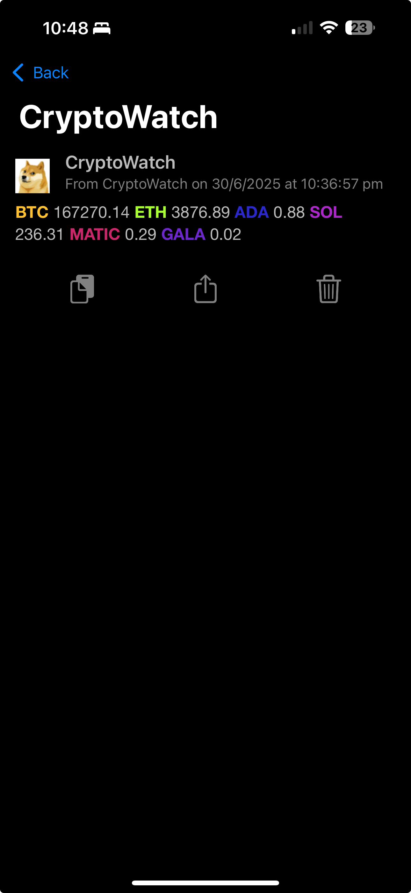
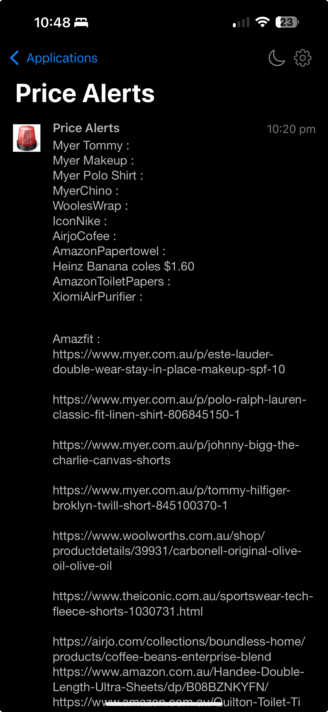
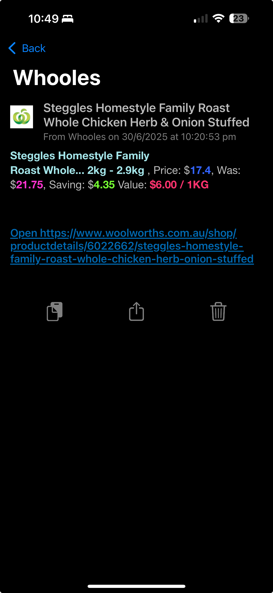

# 🧠 Huginn Projects: Automation with Custom Agents

This repository contains my curated set of [Huginn](https://github.com/huginn/huginn) agents and workflows, tailored to automate real-world use cases ranging from price monitoring to smart notifications.

Huginn is an open-source system for building agents that perform automated tasks online. Think of it as your personal IFTTT or Zapier — but self-hosted and much more powerful.

## 🚀 Features & Workflows

These agents are designed, deployed, and tested on my personal Huginn instance. They demonstrate real-world automation patterns and integrations:

### 🔍 Price Monitoring & Notifications
- **ServiceNSW Fuel Check**: Monitors fuel prices in my selected area and pushes alerts to my mobile when prices drop.
- **Woolworths Price Check**: Tracks specific grocery items at Woolworths and sends push notifications when prices fall below a target.
- **Crypto Price Alerts**: Monitors selected cryptocurrencies (e.g., BTC, ETH) and notifies me when they hit predefined thresholds.
- **Generic Price Watcher**: Tracks prices for wishlist items (e.g., Amazon, eBay, Kogan) and sends real-time alerts when deals match my criteria.

### 📢 Content & Update Monitoring
- **Forum New Post Alerts**: Notifies me when new posts are made in specific threads or sections of online forums I follow.
- **OZBargain Deal Alerts**: Automatically scrapes OzBargain and pushes notifications for hand-picked or keyword-matched bargains.

### ✅ Productivity Automation
- **Planka Integration**: Sends reminders and push notifications for tasks added or updated in my [Planka](https://planka.app/) Kanban board — keeping me informed without checking the board constantly.

## 📱 Notification Delivery

All workflows are configured to send real-time push notifications to my mobile device using:

- **Pushover / Gotify / Pushbullet** (or any compatible notification service)

## 🧩 Setup & Usage

1. **Install Huginn**: Follow the official [Huginn installation guide](https://github.com/huginn/huginn#installation).
2. **Import Scenarios**: Use the JSON export files in this repo to import workflows into your Huginn instance.
3. **Customize Agents**: Adjust input parameters such as keywords, locations, price thresholds, and endpoints for your personal needs.
4. **Configure Notifications**: Plug in your preferred push notification service for alert delivery.

## 📁 Repository Structure

```plaintext
huginn-projects/
├── fuel-check/
├── woolworths-price-check/
├── crypto-alerts/
├── generic-price-monitor/
├── forum-notifier/
├── ozbargain-alerts/
├── planka-notifier/
└── README.md
```

## 📸 Preview








